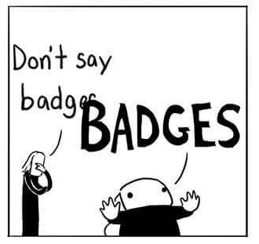

# Badges!

### What are badges?
The badges complement the Ladder - while the Ladder outlines career paths, the badges reward behaviors and achievements we respect and appreciate in our fellows.

### Can I create a badge or achievement?
Sure!
### How?
Simple. Badges must meet the following criteria:
#### 1. A badge or achievement must be a measurable, objective, pass/fail criteria.
##### Example Badge: **Good presenter**
Do: Presented to an audience of at least 50 people  
Don't: Had a nice, well structured presentation

#### 2. A badge must be achievable by one person in reasonable time
##### Example Badge: **CR Knight**
Do: Performed 1000 code reviews  
Don't: Invested 10000 hours reviewing code

#### 3. Badges must reflect behavior that are contributing to the company as well as to the team of the badge winner
##### Example badge: **CR Knight**
Do: Performed 1000 code reviews  
Don't: Performed a code review in full plate armor 1

### What are the badges for?
The Ladder exists to make career progression at Socialbakers engineering department more transparent and easier to understand.  
It outlines desirable patterns of technical excellence, effective thinking patterns, and communication skills.  
There are things that we do, however, that are great and should be celebrated, even when they do not immediately contribute to a career path. Things such as being an exceptional code reviewer, a great presenter, or a wonderful asset to the PO are not a part of the Ladder - and yet, they are important to all of us.  
The badge system is used to highlight these achievements, and allows us all to recognize the good things that you and your colleagues do here.

____

1 *That's an awesome achievement though, and should someone do this, please post pictures on Slack*
